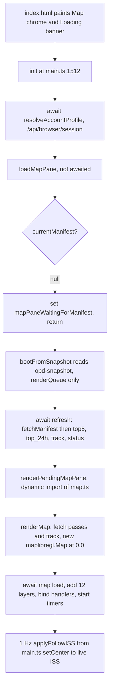

# Architecture now

This document describes the SNAP frontend as it exists at commit `a89cf2d`, before any structural change. It is a ground-truth brief for a coding agent about to work in `frontend/src`. It records what the code does, where each concern lives, and which patterns make the repo expensive for an agent to change. It proposes no target architecture. Every count in the last section has the command that regenerates it. Defects and stale docs found along the way are listed in `docs/agent/FOLLOWUPS.md` instead of being fixed here.

## Overview

SNAP is a single-page progressive web app that tells an astronaut when and where to point a camera out of the Cupola. A Python generator computes passes, scores, and ground tracks offline and writes versioned JSON artifacts. A Cloudflare Worker serves those artifacts from R2 and hosts a small API for the shot log, personal targets, weather, and aurora. The frontend fetches a `manifest.json`, renders a shot queue and a world map, and keeps working when the station loses signal.

The map is one of five tabs, and it is the largest thing in the repo. `frontend/src/map.ts` is 4569 lines and holds the MapLibre instance, the style, every source and layer, every click handler, the time scrub, the satellite picker, the pin drop, the launch corridor, and the popup DOM. `frontend/src/main.ts` is 1690 lines and holds the boot sequence, the refresh loop, the queue and upcoming renderers, and the tab switch. Those two files are 31% of the frontend source, and both are excluded from the coverage report.

There is no framework, no store library, and no module directory structure. All 57 TypeScript modules sit in one flat folder. State lives in 95 module-level `let` declarations, 24 `localStorage` keys, and the DOM. A capability is not a folder. A capability is a set of function names spread across `main.ts`, `map.ts`, and two or three leaf modules.

## Inventory

| Concern | Choice | Evidence |
| --- | --- | --- |
| Language | TypeScript 5.5, `strict`, `noUncheckedIndexedAccess`, `verbatimModuleSyntax` | `frontend/tsconfig.json` |
| Bundler | Vite 5.4, `vite-plugin-pwa` 1.2 with Workbox | `frontend/vite.config.ts` |
| Package manager and test runner host | Bun | `frontend/bun.lock`, `.github/workflows/test.yml` |
| Map library | `maplibre-gl` ^4.7.0, imperative API, no React wrapper | `frontend/package.json` |
| UI framework | None. Hand-written DOM, 331 `document.createElement` calls | `grep -h createElement frontend/src/*.ts \| wc -l` |
| Markup | One `index.html` with five panes and the map overlay dock | `frontend/index.html` |
| State | Module-level `let`, `localStorage`, DOM. One pub/sub class, one CustomEvent bus | `launch-store.ts`, `profile-events.ts` |
| Styling | One stylesheet, `frontend/src/style.css` | |
| Frontend tests | Vitest 1.6 on `happy-dom`, 89 files, 19133 lines | `frontend/vite.config.ts` lines 324 to 334 |
| Worker tests | Vitest, 8 files, hand-rolled `fetch` calls, no miniflare | `worker/test/` |
| Generator tests | pytest, 24 files, CI gate `--cov-fail-under=85` | `.github/workflows/test.yml` |
| Lint | `ruff` on `generator/` and `tests/` only. No ESLint, Biome, Prettier, dependency-cruiser, or knip anywhere | `.github/workflows/test.yml`, `Makefile` |
| CI | One workflow, three jobs: Python, Worker, Frontend | `.github/workflows/test.yml` |
| Backend | Python generator writes artifacts, Cloudflare Worker serves them from R2 | `generator/`, `worker/src/index.ts` |

The frontend CI job runs `bun run typecheck`, `bun run test`, and `bun run build`. It does not run coverage, so the thresholds in `vite.config.ts` never execute. No CI job enforces any rule about imports, file placement, or comments.

## Key concepts

**Map instance.** One module-level `let map: maplibregl.Map | null` at `map.ts:56`. `renderMap(manifest)` at `map.ts:1036` constructs it on first call and reuses it forever after. Nothing else in the app holds a reference. There is no destroy path: no `map.remove()` exists, and `map = null` happens only in the test-only setter `_setFollowEnvForTest` at `map.ts:3119`.

**Camera.** Not modeled. The camera is whatever MapLibre currently holds, and nine call sites move it. `center: [0, 0]` and a viewport-derived zoom are set in the constructor at `map.ts:1056`. `projection` and `pitch` are never set, so Mercator and pitch 0 are inherited defaults. Bearing is not a camera field in any type. It is a persisted string mode, `'north'` or `'iss-up'`, read by `readBearingMode` at `map.ts:497` and applied by `applyBearing` at `map.ts:2124`.

**View state.** Two separate clocks, neither one a type. `viewTimeMs` at `map.ts:84` is `null` when the map shows live time and an absolute UTC instant when the operator has scrubbed the time slider. Wall-clock `Date.now()` is used independently by the topbar ISS readout, the satellite readouts, the target popup countdown, and the pin drop pass scan at `map.ts:3873`. A scrubbed map and a live popup can disagree, and that is intended behavior today.

**Style.** One style object built by `buildStyle()` at `map.ts:567`. It declares 7 sources and 5 layers. `setStyle` is never called. A basemap change is a visibility change on layers that all coexist inside the one style, arbitrated by `applyCloudsVisibility` at `map.ts:2633`. This is load-bearing: every runtime source, layer, and event handler assumes the style object survives for the life of the page.

**Sources.** 7 are declared in `buildStyle`: `carto-dark`, `gibs-clouds`, `esri-imagery`, `ne-coastline`, `viirs-night-lights`, `geo-ir`, `esri-labels-reference`. 10 GeoJSON sources are added at runtime through `upsertGeoJson` at `map.ts:3180`, which calls `setData` if the source exists and `addSource` if it does not: `iss-track`, `terminator-line`, `subsolar-point`, `terminator-night-fill`, `targets`, `my-targets`, `ascent-trajectory`, `ascent-pad`, `lookup-pin`, and `dropped-pin`. The raster `fcst-clouds` is added directly at `map.ts:2576`, and one templated `sat-track-${key}` exists per selected satellite. Every id is a bare string literal at its use site.

**Layers.** 21 layers exist, 20 with literal ids and one built from a template. Five come from the style, and 16 are added by the 16 `addLayer` call sites. Insertion order is visual order, so the order of those calls is behavior. See the table below.

**Overlays.** The word does not appear in the code as a concept. What a user calls an overlay is a mix of three unrelated mechanisms. Raster overlays (clouds, IR, night lights, labels) are style layers toggled by `setLayoutProperty`. Vector overlays (terminator, targets, ground track, launch corridor, pins) are GeoJSON sources refreshed by `setData`. The ISS itself and each extra satellite are HTML `maplibregl.Marker` elements outside the canvas, created by `createIssMarkerElement` at `map.ts:3566`.

**Interaction.** No tool or mode concept. There are 25 `map.on(...)` registrations across 14 event types, all inside `renderMap`, several guarded by `if (!map.getLayer(...))` so that re-entering `renderMap` does not double-bind them. Launch mode is the closest thing to a mode, and it is a boolean with listeners in `map-launch-mode.ts`, 16 lines total.

**Geocoding.** Nominatim, in `profile-geocode.ts`, with an LRU cache under `opd-geocode-cache-v1`. It is a Profile pane feature and never touches the map. The map's own place search does not exist.

**Routing.** No router. The active tab is a CSS class on `#view` set by `setActive` at `main.ts:1198`, and reload always lands on the Map tab because `index.html` ships `class="view-map"`. The only URL state is `?u=<profile>`, which `init` rewrites to the verified session name at `main.ts:1517`. Map camera, active tab, and scrub time are not in the URL and not restored.

**Persistence.** Three tiers. `localStorage` holds 24 keys covering the profile, overlay toggles, bearing mode, selected satellites, the offline snapshot, the calibration queue, the shot list, and the launch artifact. `sessionStorage` holds one key for offline session resume. Workbox caches the app shell, versioned artifacts, and map tiles. The camera is in none of them.

## How a user action becomes pixels

### Boot to first paint

Two things in that path surprise a reader. The offline snapshot restores the queue but never paints the map, so on a slow uplink the cards are ready while the Map tab, which is the default tab, stays blank until the first network round trip returns. And the first camera move to the ISS does not happen in `renderMap`. The map is built at `[0, 0]` and waits for the next 1 Hz `applyFollowISS` tick in `main.ts:1089` to recenter, because follow mode defaults on at `map.ts:2554` without being persisted.

### Toggling the clouds overlay

A tap on `#toggle-clouds` runs the handler bound by `bindCloudToggle` at `map.ts:2682`. It flips the module `let cloudsVisible`, writes `opd-map-clouds-visible`, and calls `applyCloudsVisibility` at `map.ts:2633`. That function is the basemap arbiter. It computes `useEsri = !cloudsVisible && !irVisible && !esriTilesFailed`, then issues `setLayoutProperty(id, 'visibility', ...)` for `esri-imagery-layer`, `carto-dark-layer`, `gibs-clouds-layer`, and `geo-ir-layer`. Nothing is added or removed, and the next MapLibre frame is the paint. The toggle state for the overlay and the identity of the basemap are the same decision, which is why turning clouds off also changes the basemap to satellite imagery.

### Dragging the time slider

`bindTimeSlider` at `map.ts:2403` handles `input` through a `requestAnimationFrame` coalescer and splits the work into two tiers to keep the drag smooth. Tier one runs every frame and moves only the ISS marker and the time labels. Tier two runs at most every 150 ms and refreshes the ground track, the terminator sources, the target `in_window` flags, and the satellite tracks. `setLookahead` at `map.ts:2291` is the single entry point: it sets `viewTimeMs`, then calls `refreshGroundTrackSource`, `refreshTargetsSource`, `refreshTerminatorSources`, and the satellite refresh, each of which builds GeoJSON and calls `setData`. On `change`, meaning pointer release, it also eases the camera. The IR raster deliberately stays at live time while everything else moves, and the imagery badge says so.

## Where things live today

| Concern | Files |
| --- | --- |
| Boot, refresh loop, tab switch, toast | `main.ts` |
| Shot queue and upcoming lists | `main.ts` (`renderQueue` 439, `renderUpcoming` 609), `card.ts`, `countdown.ts`, `score-stars.ts`, `empty-hint.ts`, `sort-pref.ts`, `target-filter-pref.ts`, `pass-thumbnail.ts` |
| Map instance, style, camera, all layers, all handlers | `map.ts` |
| Basemap switch and cloud overlay | `map.ts` (`buildStyle` 567, `applyCloudsVisibility` 2633, `bindCloudToggle` 2682), `tile-precache.ts` |
| IR imagery | `map.ts` 2806 to 2947, `tile-precache.ts` (`pickGeoIRSat` 115) |
| VIIRS night lights | `map.ts` 2717 to 2797, `viirs-alpha-protocol.ts` |
| Terminator | `terminator.ts` (math and GeoJSON), `map.ts` (`refreshTerminatorSources` 1742, `bindTerminatorToggle` 2991) |
| ISS marker and ground track | `map.ts` (`groundTrackFeatures` 916, `splitTrackByOrbit` 819, `createIssMarkerElement` 3566), `iss.ts`, `iss-sgp4.ts`, `track-offset.ts` |
| Time scrub | `map.ts` (`viewTimeMs` 84, `setLookahead` 2291, `bindTimeSlider` 2403) |
| Extra satellites | `satellites.ts` (TLE fetch and cache), `map.ts` 4183 to 4312 (picker, tracks, markers) |
| Pin drop | `pin-drop.ts` (geometry), `map.ts` (`buildPinDropPopup` 3930, `buildPinAddFooter` 4030) |
| Launch data and selection | `launch-schema.ts`, `launch-store.ts`, `launch-selectors.ts`, `launch-card.ts`, `launch-map-brief.ts`, `map-launch-mode.ts` |
| Launch geometry on the map | `map.ts` (`buildLaunchMapFeatures` 1813, `applyMapLaunchVisibility` 1862, `focusLaunchOnMap` 1934) |
| Personal targets and profile | `profile.ts`, `profile-ui.ts`, `profile-crud.ts`, `profile-api.ts`, `profile-session.ts`, `profile-events.ts`, `profile-target-sync.ts`, `profile-geocode.ts`, `profile-json-io.ts`, `csv-parse.ts` |
| Shot log | `calib.ts`, `log.ts`, `shot-counts.ts` |
| Shot list and calendar export | `shotlist.ts`, `ics.ts`, `calendar-share.ts` |
| Photo lookup and KML | `photo-lookup.ts`, `kml.ts` |
| Data fetching and artifact verification | `manifest.ts` |
| Offline behavior | `snapshot.ts`, `network-status.ts`, `network-probe.ts`, `sw-navigation.ts`, `tile-precache.ts`, `banner.ts`, Workbox config in `vite.config.ts` |
| Almanac math | `moon.ts`, `sun.ts`, `beta-angle.ts`, `aurora.ts`, `photo-conditions.ts` |
| Weather | `wx.ts`, `cloud.ts` |
| Types | `types.ts`, imported by 22 modules |
| Help content | `help.ts` |

### Layers and their order

Insertion order is the paint order, so this table is behavior. Nothing asserts it today.

| Order | Layer id | Source | Added at | Default visibility |
| --- | --- | --- | --- | --- |
| 1 | `esri-imagery-layer` | `esri-imagery` | `map.ts:701` (style) | `none` |
| 2 | `carto-dark-layer` | `carto-dark` | `map.ts:708` (style) | visible |
| 3 | `gibs-clouds-layer` | `gibs-clouds` | `map.ts:714` (style) | visible |
| 4 | `geo-ir-layer` | `geo-ir` | `map.ts:725` (style) | `none` |
| 5 | `ne-coastline-layer` | `ne-coastline` | `map.ts:736` (style) | visible |
| 6 | `iss-track-layer` | `iss-track` | `map.ts:1133` | visible |
| 7 | `my-targets-casing` | `my-targets` | `map.ts:1209` | visible |
| 8 | `my-targets-layer` | `my-targets` | `map.ts:1224` | visible |
| 9 | `targets-layer` | `targets` | `map.ts:1243` | visible |
| 10 | `night-lights-global-dim-layer` | none, background | `map.ts:1385`, `beforeTrack` | conditional |
| 11 | `terminator-night-fill-layer` | `terminator-night-fill` | `map.ts:1396`, `beforeTrack` | visible |
| 12 | `viirs-night-lights-layer` | `viirs-night-lights` | `map.ts:1441`, `beforeTrack` | `none` |
| 13 | `terminator-line-layer` | `terminator-line` | `map.ts:1450` | visible |
| 14 | `subsolar-point-layer` | `subsolar-point` | `map.ts:1469` | visible |
| 15 | `ascent-trajectory-layer` | `ascent-trajectory` | `map.ts:1488` | `none` |
| 16 | `ascent-pad-layer` | `ascent-pad` | `map.ts:1501` | `none` |
| 17 | `esri-labels-reference-layer` | `esri-labels-reference` | `map.ts:1607` | visible |
| later | `fcst-clouds-layer` | `fcst-clouds` | `map.ts:2592`, before `ne-coastline-layer` | `none` |
| later | `lookup-pin-layer` | `lookup-pin` | `map.ts:3517` | visible |
| later | `dropped-pin-layer` | `dropped-pin` | `map.ts:3840` | visible |
| later | `sat-track-layer-${key}` | `sat-track-${key}` | `map.ts:4262` | visible |

Three of those inserts pass `beforeTrack`, computed once at `map.ts:1377`. The reason is recorded at `map.ts:1369`: in v1.6.18 the VIIRS raster stacked above the ground track and hid it. The comment at `map.ts:1607` calls the labels layer topmost, and four layers are added above it afterwards.

### Camera call sites

| Call | Site | Trigger |
| --- | --- | --- |
| `easeTo` center, 600 ms | `map.ts:139` | Snap back to live while follow is on |
| `easeTo` center and zoom 4 | `map.ts:1951` | `focusLaunchOnMap`, pad with no corridor |
| `fitBounds`, padding 50, maxZoom 5 | `map.ts:1955` | `focusLaunchOnMap` with a corridor |
| `easeTo` bearing | `map.ts:2129`, `map.ts:2139` | Bearing toggle, and once on first init |
| `setBearing` | `map.ts:2130`, `map.ts:2140` | 1 Hz iss-up tracking, skipped under 0.5 degrees |
| `easeTo` center | `map.ts:2302`, `2317`, `2374` | `setLookahead` with recenter |
| `setCenter` | `map.ts:3027` | 1 Hz follow. Must not be `easeTo`, which queues animations |
| `flyTo`, 800 ms, `essential` | `map.ts:3091` | Follow button turned on |
| `easeTo` center, zoom at least 4 | `map.ts:3557` | Photo lookup pin |

`jumpTo` is never used, and no code reads the camera back into app state.

## Gotchas

**The map is a hidden singleton with no teardown.** `map`, `issMarker`, `liveTimer`, `timeLabelTimer`, `viewTimeMs`, `followISS`, and `selectedSatellites` are module state in `map.ts`. 55 of the 95 module-level `let` declarations in the frontend are in that one file. Two interval tickers, guarded by `_satTrackTickerStarted` at `map.ts:1634` and `irTickerStarted` at `map.ts:2904`, start once and are never cleared.

**`renderMap` is the constructor, the refresher, and the binder.** It runs on the first Map tab open and again on every manifest version change. Correctness depends on a set of `if (!map.getLayer(...))` and boolean latch guards to avoid duplicate layers and duplicate handlers. An agent adding a layer must know which half of the function is idempotent.

**Basemap swap is a visibility swap, not `setStyle`.** The comment at `map.ts:2653` rejects style rebuilds explicitly. Any refactor that reintroduces `setStyle` silently drops all 12 runtime GeoJSON sources, the `viirs-alpha` protocol layer, and every bound handler.

**Two clocks, no type separating them.** `currentViewMs()` drives the map surface. `Date.now()` drives the topbar, the satellite readouts, the target popup countdown, and the pin-drop pass scan at `map.ts:3873`. A reader cannot tell which clock a function uses from its signature.

**Layer and source ids are bare strings at every use site.** 21 layers and 19 sources, each id written as a literal wherever it is needed, up to 7 times for `ascent-pad-layer`. A typo compiles and fails silently, because MapLibre throws on a missing layer and the calls sit inside `try` blocks.

**Duplicated geo math, with two different Earth radii.** `wrapLon` is exported from `iss.ts:14`, reimplemented privately in `terminator.ts:55`, and inlined twice more in that file. The antimeridian split is written four times in `map.ts` alone: `buildLineFeatures` 762, `terminatorFeatures` 126, the night polygons at 416, and the launch unwrap at 1828. `EARTH_RADIUS_KM` is 6378.137 in `iss-sgp4.ts`, `pin-drop.ts`, and `terminator.ts`, and 6371 in `moon.ts`, `photo-conditions.ts`, and `beta-angle.ts`. Do not collapse those two constants without checking generator parity. The sun elevation formula appears three times, including twice inside `aurora.ts` where line 251 inlines what line 264 already exports.

**A wrong comment guards a real code clone.** The comment above `applyDistanceFilter` at `main.ts:427` says the function delegates to `filterPassesByDistance` and is tested through that helper. The function does not import it. The two filters are line-for-line identical and can drift apart without any test failing. `map.ts:305` reads the distance threshold from `parseProfileFromURL` only, while `main.ts` reads it from the resolved session profile, so map pin filtering and queue filtering can disagree for a signed-in crew member.

**Three import cycles.** `iss.ts` and `iss-sgp4.ts` import each other. `calib.ts:7` imports `getCurrentProfile` from `main.ts`, which imports `calib.ts`, and `log.ts` closes a triangle. `map.ts:25` imports `handleAdd` from `profile-crud.ts`, which imports `getCurrentManifest` from `main.ts:53`, which dynamically imports `map.ts`. Two of the three carry a comment describing the cycle as acceptable if called lazily.

**HTML defaults disagree with JavaScript defaults.** `index.html:122` marks the north-up button active, while `readBearingMode` defaults to `iss-up`. The follow button ships inactive, while `followISS` starts true. The test-only reset `_resetMapStateForTest` at `map.ts:517` forces `bearingMode = 'north'`, the opposite of production.

**GIBS imagery date is frozen at first style build.** `yesterdayIso()` is baked into the tile URL at `map.ts:568` and never updated with `setTiles`. A tab left open across UTC midnight keeps showing the previous composite. The imagery badge is the only thing that tells the operator.

**Comments are used as architecture.** `map.ts` is 28% comment lines and `main.ts` is 31%. They are not line narration. They are decision logs, operator-feedback records, and inline changelogs, such as the opacity history at `map.ts:1417` and the reason IR ships off at `map.ts:375`. Some of this is the only record of why a default exists. Some of it is stale: the file header at `map.ts:3` describes a five-layer stack that predates Esri, IR, the terminator, and the labels layer. An agent cannot tell which comments are load-bearing.

**Coverage excludes the two files that need it.** `vite.config.ts:331` excludes `src/main.ts` and `src/map.ts`. The frontend CI job never passes `--coverage`, so the thresholds are inert regardless.

## Agent-hostile patterns

Grouped by the failure they cause for an agent making a change.

**Feature logic has no home.** Adding a map overlay today means editing `buildStyle` for the source, `renderMap` for the layer, a new `bind*Toggle` function for the control, `index.html` for the button, `refresh*Source` for updates, `applyCloudsVisibility` if it interacts with the basemap, `setLookahead` if it is time-aware, and `tile-precache.ts` if it has tiles. All but one of those edits land in the same 4569-line file, at six different line ranges. There is no example to copy that keeps the change in one place, because no such example exists.

**`map.ts` is the god module and `main.ts` is the god orchestrator.** `main.ts` imports 35 local modules statically and 5 more dynamically. `map.ts` imports 21, and `profile-crud.ts` imports 12. `map.ts` reaches into the profile store, the launch store, the target filter preference, the shot counts, the banner, and the live weather API. An agent reading `map.ts` to change a layer must load the profile model, the launch model, and the preference model to understand it.

**Illegal states are representable everywhere.** A layer id is a `string`, so `setLayoutProperty('targets-layr', ...)` typechecks and is swallowed by a `try` block. A source can be absent while its layer is visible, and the code handles that with defensive `getLayer` checks rather than by construction. `viewTimeMs` being `null` versus a number encodes live versus scrubbed, and nothing forces a caller to handle both. Camera state and selection state are unrelated variables. No type prevents a scrubbed map from showing a live countdown, which is why that behavior exists as a documented quirk instead of a decision.

**Layer boundaries do not exist, so they cannot be violated or enforced.** `maplibregl` types appear directly in function signatures throughout `map.ts`, including in functions that are otherwise pure. There is no adapter. There is also no lint rule that could notice, because the repo has no JavaScript or TypeScript linter at all. The only protection against `map.ts` being imported eagerly is that `main.ts` uses `await import('./map')`, which is a convention, not a rule.

**Comments carry the architecture.** See the gotcha above. The stale header at `map.ts:3` is the clearest case: an agent that trusts it will insert a layer in the wrong place.

**There is no single way to do anything.** Three different mocking strategies appear across the map tests: an inline fake map with production logic copied into the test, a regular expression over the text of `map.ts`, and injection of a fake map through `_setFollowEnvForTest`. The first strategy has already failed once, and `time-scrub.test.ts:6` records that the copy stayed green while `map.ts` drifted. There is no shared test helper module, so each of the 13 `map-*.test.ts` files invents its own fake. An agent copying the nearest test copies a strategy that cannot catch a regression.

## Phase 1 readiness

The baseline any structural change has to keep green is 1637 frontend tests in 89 files, 196 worker tests in 8 files, and a clean `tsc --noEmit` in both. Measured with `bun run test` and `bun run typecheck` in `frontend/` and `worker/` at this commit.

The pin inventory below is the reason to be careful. "Literal" means a test asserts a production value. "Copy" means the test asserts a duplicate of the logic and cannot see production drift. "Grep" means the test matches the text of `map.ts` with a regular expression.

| Behavior | Pinned | Evidence |
| --- | --- | --- |
| Default center `[0, 0]` | No | Nothing reads it |
| Default zoom | Helper only | `map-zoom.test.ts` pins `initialZoomForViewport`. Nothing pins that `renderMap` passes it to the constructor |
| Projection, pitch | No | Never set, never asserted |
| Bearing default and persistence | No | `map-bearing.test.ts` pins `greatCircleBearingDeg` in `pin-drop.ts`, not `applyBearing` |
| Layer order | No | No test reads an ordered list of layer ids |
| Default layer visibility | Partial | IR `none` by grep. Labels by copy. Launch layers by literal. Clouds, terminator, night lights, multi-orbit, follow have no production-reader test |
| Source to layer wiring | Partial | `map-launch-mode-layer.test.ts` asserts `setData` on a fake. No test asserts `layer.source` for any real layer |
| Feature click and selection | Partial | `pickTargetAtTap` and `buildTargetPopupContent` are pinned as literals. The `map.on('click')` path, the 7 pixel bounding box, and the layer priority order are not |
| `fitBounds` and `easeTo` | Partial | `focusLaunchOnMap` is pinned against a real fake at `launch-map-brief.test.ts`. `applyFollowISS` `setCenter` is pinned. The follow-toggle `flyTo` is a copy. Lookup pin and scrub recenter are unasserted |
| Basemap swap | Copy and grep | `map-basemap.test.ts` duplicates `applyVis` and omits the IR and forecast gates that production has |
| Overlay add and remove | Partial | Launch visibility swap is pinned. Dynamic `addSource` and `addLayer` for forecast, pins, and satellite tracks are not |
| View state serialization | No for camera | No camera is serialized. Overlay preference round-trips are copies, except the launch brief open state, which is pinned |

Pins are cheap for three of the gaps and moderate for the rest.

Exporting `buildStyle` makes the five style layers, their sources, and their default visibility a single literal assertion. `map-basemap.test.ts:3` already records wanting this. That is the highest-value pin in the repo and it is roughly ten lines of test.

Recording runtime `addLayer(spec, beforeId)` calls needs a fake map. `fakeMap()` in `map-launch-mode-layer.test.ts` is the most complete one and already records visibility and `setData`. Extending it to record insertion order, then pinning the full 21-row layer table, is the second pin. It does not need WebGL.

Calling the real `applyCloudsVisibility` against that fake, instead of the copied `applyVis`, closes the basemap drift hole.

The default camera resists a cheap unit pin because `renderMap` constructs MapLibre directly. Two options exist. A source grep in the style of `map-ir.test.ts` is cheap and weak. Extracting the constructor options into an exported pure function and asserting the object is slightly more work and is a real pin. The second is worth it before any camera code moves.

`scripts/launch_qa_server.ts` is the verification lever for anything a unit test cannot reach. It serves the built app from `frontend/dist` on `127.0.0.1:8769` with synthetic passes, tracks, targets, launch envelopes, and a fake signed-in session, and it never contacts production. Basemap tiles still come from the public CDNs. The loop is `cd frontend && bun run build`, then `bun scripts/launch_qa_server.ts`, then open the Map tab against that origin.

## Counts and how to regenerate them

Run from the repository root.

| Claim | Command |
| --- | --- |
| 57 TypeScript modules in one flat directory | `ls frontend/src/*.ts \| grep -v vite-env \| wc -l` and `find frontend/src -type d` |
| 20397 lines of frontend source | `wc -l frontend/src/*.ts \| tail -1` |
| `map.ts` 4569 lines, `main.ts` 1690 | `wc -l frontend/src/map.ts frontend/src/main.ts` |
| 95 module-level `let`, 55 of them in `map.ts` | `grep -hE '^let ' frontend/src/*.ts \| wc -l` |
| 331 `createElement` calls | `grep -h createElement frontend/src/*.ts \| wc -l` |
| 28% and 31% comment lines | `grep -cE '^\s*(//\|/\*\|\*)' frontend/src/map.ts frontend/src/main.ts` |
| 16 `addLayer` call sites, 20 literal layer ids | `grep -c 'addLayer(' frontend/src/map.ts` and `grep -oE "id: '[a-z0-9-]+'" frontend/src/map.ts \| sort -u \| wc -l` |
| 25 `map.on` registrations | `grep -cE '\bmap\.on\(' frontend/src/map.ts` |
| 35 static and 5 dynamic local imports in `main.ts`, 21 in `map.ts` | `grep -hoE "from '\./[a-z0-9.-]+'" frontend/src/main.ts \| sort -u \| wc -l` |
| 24 `localStorage` key literals | `grep -rhoE "'opd[-_][a-z0-9_:.-]*'" frontend/src/*.ts \| sort -u \| wc -l` |
| 89 frontend test files, 13 map tests | `ls frontend/test/*.test.ts \| wc -l` and `ls frontend/test/map*.test.ts \| wc -l` |
| No JavaScript or TypeScript linter | `grep -rn eslint frontend/package.json worker/package.json` returns nothing |
| Coverage excludes `main.ts` and `map.ts` | `grep -n exclude frontend/vite.config.ts` |
